# Final Project Teknologi Komputasi Awan 2026

**Kelompok:** FP-TKA-4A  
**Mata Kuliah:** Teknologi Komputasi Awan

---

## Anggota Kelompok


| NRP | Nama |
|------------|--------------------------|
| 5027241008 | Paundra Pujo |
| 5027241022 | Ardhi Putra Pradana |
| 5027241048 | Afrizan Rasya |
| 5027241058 | Ica Zika Hamizah |
| 5027241064 | Hanif Mawla Faizi |
| 5027241093 | M. Atha Tajuddin |

---

## 1. Introduction

Proyek ini merupakan Final Project mata kuliah Teknologi Komputasi Awan 2026. Kami berperan sebagai Cloud Engineer di sebuah startup e-commerce yang diminta untuk men-deploy, mengonfigurasi, dan mengoptimalkan **Order Processing Service** — layanan backend berbasis REST API (Python Flask + MongoDB) yang menangani pembuatan pesanan, pengecekan status, dan riwayat transaksi.

Tantangan utama adalah merancang infrastruktur cloud yang mampu menangani lonjakan traffic (flash sale, promo) secara andal dan efisien, dengan **budget maksimal ≈ 75 US$/bulan**.

Aplikasi menyediakan 4 endpoint utama:

| Method | Endpoint | Deskripsi |
|--------|----------|-----------|
| POST | `/order` | Membuat pesanan baru |
| GET | `/order/<order_id>` | Mengambil detail & status pesanan |
| GET | `/orders` | Mengambil seluruh riwayat pesanan |
| PUT | `/order/<order_id>` | Mengubah status pesanan |

---

## 2. Arsitektur Cloud

### Diagram Arsitektur

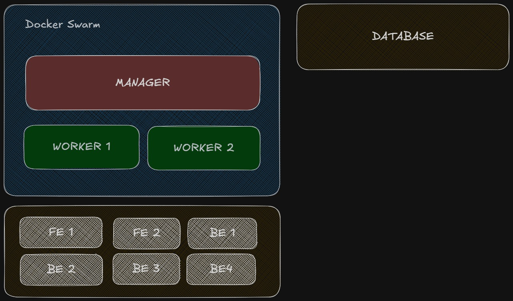

Arsitektur yang digunakan adalah **Docker Swarm** dengan topologi multi-node:

- **Manager Node** — Menjalankan Traefik sebagai reverse proxy & load balancer (port 80 dan dashboard 8080)
- **Worker Nodes** — Menjalankan 4 replica backend Flask dan 2 replica frontend
- **Database Node** — MongoDB berdiri di VM terpisah (standalone, tidak masuk Swarm)

Traffic masuk diterima Traefik di Manager, kemudian didistribusikan ke replica backend via overlay network `traefik-pub`. Backend berkomunikasi ke MongoDB melalui IP internal.

### Spesifikasi VM & Harga

Menggunakan **Digital Ocean** (Credit $200): (masih salah, harus di cek lagi)

| No | Nama VM | Peran | Spesifikasi | Harga/bulan |
|----|---------|-------|-------------|-------------|
| 1 | manager | Swarm Manager + Traefik LB | 2 vCPU, 2 GB RAM | $18 |
| 2 | worker-1 | Swarm Worker (BE + FE) | 2 vCPU, 2 GB RAM | $12 |
| 3 | worker-2 | Swarm Worker (BE + FE) | 2 vCPU, 2 GB RAM | $12 |
| 4 | db | MongoDB | 1 vCPU, 2 GB RAM | $18 |
| | | | **Total** | **$60/bulan** |

Total biaya **$60/bulan**, masih di bawah budget $75.

### Alasan Pemilihan Konfigurasi

- **Docker Swarm** dipilih karena ringan, built-in ke Docker, dan cukup untuk skala ini dibanding Kubernetes yang overhead-nya lebih besar.
- **Traefik** sebagai load balancer karena integrasi native dengan Docker Swarm via label, serta auto-discovery service tanpa reload config.
- **4 replica backend** memaksimalkan throughput pada 2 worker node (2 container/node), memanfaatkan seluruh core yang tersedia.
- **DB terpisah** menghindari resource contention antara MongoDB dan aplikasi — query I/O MongoDB tidak bersaing dengan CPU Flask.
- **MongoDB indexing** pada field `order_id` dan `created_at` mempercepat query `GET /orders` yang melakukan sort descending.
- Konfigurasi ini memberikan **performa tinggi** sekaligus **biaya efisien** karena tidak ada VM yang idle.

---

## 3. Implementasi

### 3.1 Persiapan VM

Lakukan pada setiap VM (manager, worker-1, worker-2):

```bash
# Update & install Docker
sudo apt update && sudo apt upgrade -y
curl -fsSL https://get.docker.com | sh
sudo usermod -aG docker $USER
```

Bukti Screenshot docker berhasil di set up : 


### 3.2 Setup MongoDB (VM: db)

```bash
# Jalankan MongoDB via Docker Compose
mkdir -p ~/db && cd ~/db
# Salin file infra/db/docker-compose.yaml ke VM ini
docker compose up -d

# Restore dump data awal
docker cp ./dump mongodb:/dump
docker exec -it mongodb mongorestore /dump
```

Verifikasi MongoDB berjalan:

```bash
docker exec -it mongodb mongosh --eval "db.adminCommand('ping')"
```

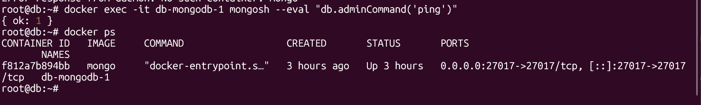

Tambahkan index untuk optimasi:

```bash
docker exec -it mongodb mongosh orderdb --eval "
  db.orders.createIndex({ order_id: 1 });
  db.orders.createIndex({ created_at: -1 });
"
```

### 3.3 Inisialisasi Docker Swarm (VM: manager)

```bash
# Init swarm di manager
docker swarm init --advertise-addr <IP_MANAGER>
```

Salin token worker yang muncul, lalu jalankan di setiap worker:

```bash
# Di worker-1 dan worker-2
docker swarm join --token <TOKEN_WORKER> <IP_MANAGER>:2377
```

Verifikasi node bergabung:

```bash
# Di manager
docker node ls
```

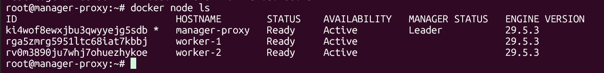

### 3.4 Deploy Stack Aplikasi (VM: manager)

```bash
# Buat overlay network
docker network create --driver overlay --attachable traefik-pub
docker network create --driver overlay --attachable app-net

# Deploy stack (gunakan file infra/apps/docker-stack.yaml)
docker stack deploy -c docker-stack.yaml order
```

Pantau status deployment:

```bash
docker stack services order
docker service ls
```

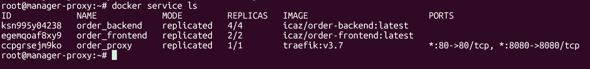

### 3.5 Konfigurasi Traefik

Traefik dikonfigurasi via label di `docker-stack.yaml`:

- Backend route: `PathPrefix(/api)` → strip prefix `/api` → forward ke port 5000
- Frontend route: `PathPrefix(/)` → forward ke port 80
- Dashboard Traefik tersedia di `http://<IP_MANAGER>:8080`

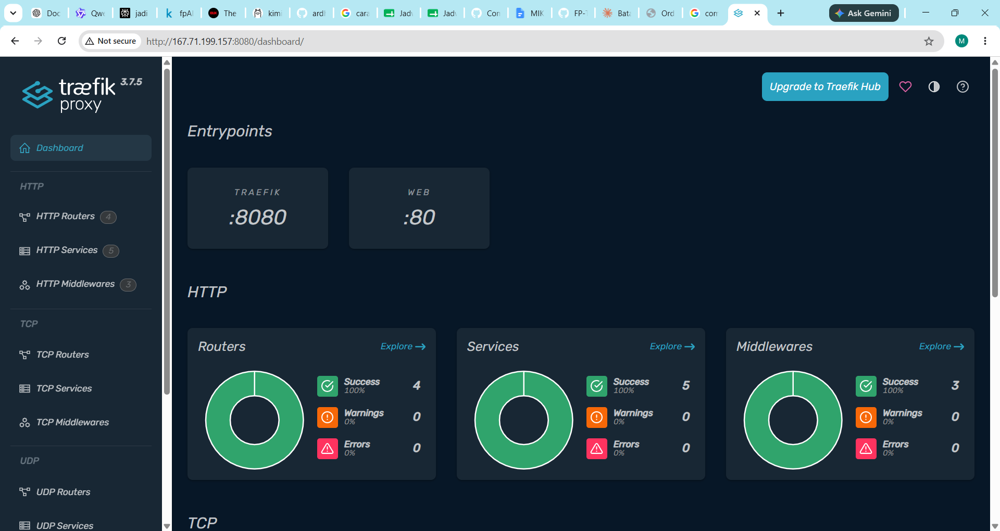

### 3.6 Verifikasi Frontend

Buka browser ke `http://<IP_MANAGER>/` untuk mengakses antarmuka frontend.

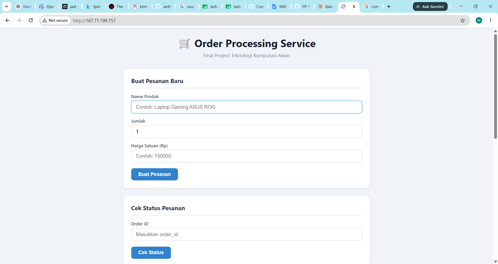

---

## 4. Hasil Pengujian Endpoint

Pengujian dilakukan menggunakan **apidog** ke base URL `http://<IP_MANAGER>/api`.

### 4.1 POST /order — Create Order

**Request:**
```json
{
  "product": "Laptop Gaming",
  "quantity": 1,
  "price": 15000000
}
```

**Expected Response (201 Created):**
```json
{
  "order_id": "<uuid>",
  "product": "Laptop Gaming",
  "quantity": 1,
  "price": 15000000,
  "total": 15000000,
  "status": "pending",
  "created_at": "2026-06-17T10:00:00Z"
}
```

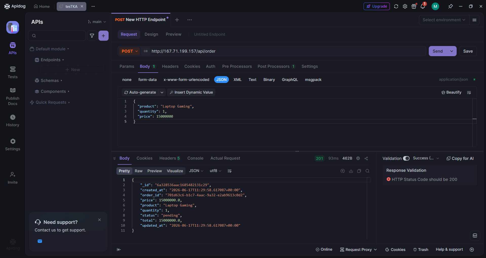

### 4.2 GET /order/\<order_id\> — Get Order Status

Gunakan `order_id` dari hasil POST di atas.

**Expected Response (200 OK):**
```json
{
  "order_id": "<uuid>",
  "product": "Laptop Gaming",
  "quantity": 1,
  "price": 15000000,
  "total": 15000000,
  "status": "pending",
  "created_at": "2026-06-17T10:00:00Z"
}
```

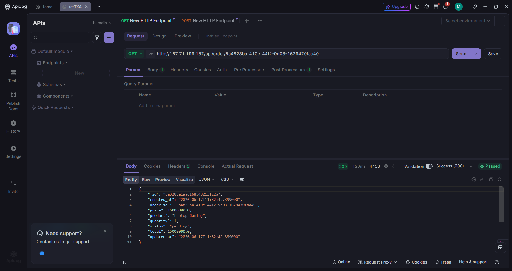

### 4.3 GET /orders — Get Order History

**Expected Response (200 OK):** Array seluruh pesanan, diurutkan terbaru lebih dulu.


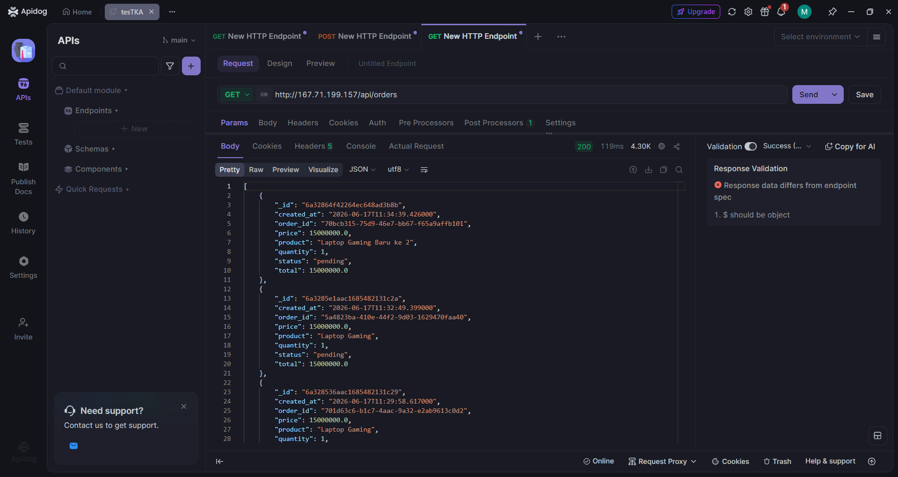

### 4.4 PUT /order/\<order_id\> — Update Order Status

**Request:**
```json
{ "status": "completed" }
```

**Expected Response (200 OK):**
```json
{
  "order_id": "<uuid>",
  "status": "completed"
}
```

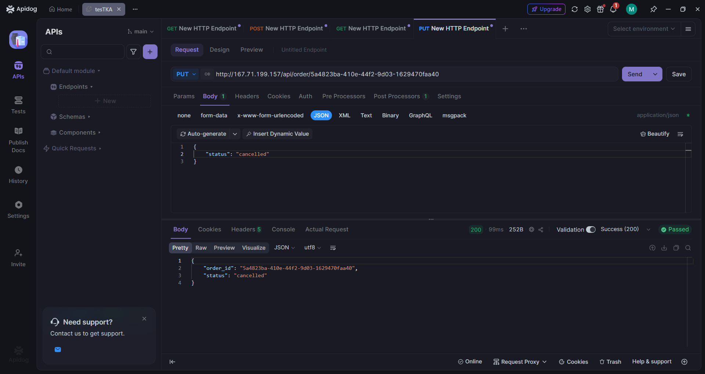


### 4.5 Tampilan Frontend

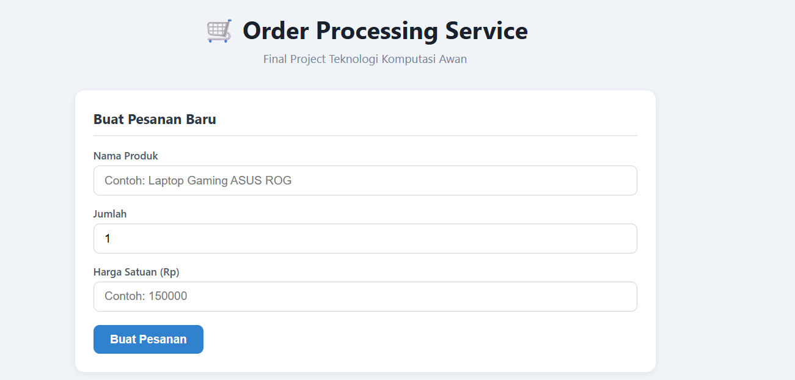

Cek Status & Update Status Pesanan : 

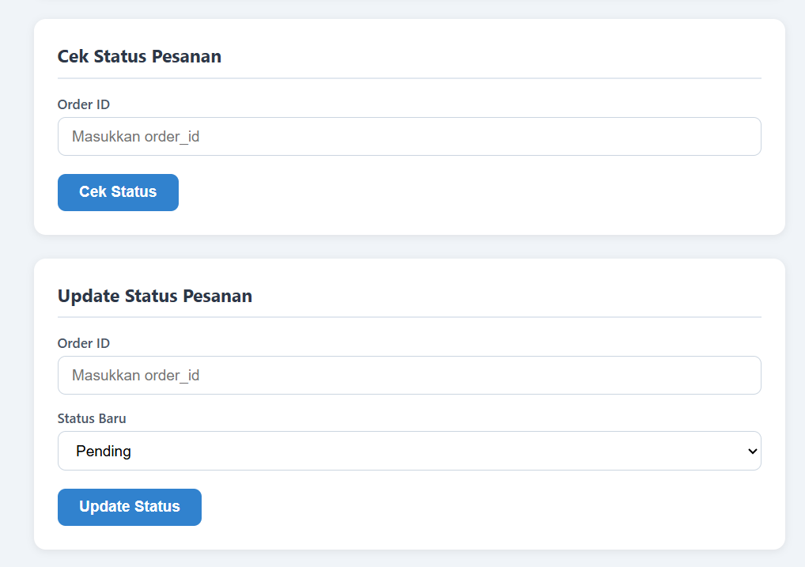

Riwayat Pesanan : 

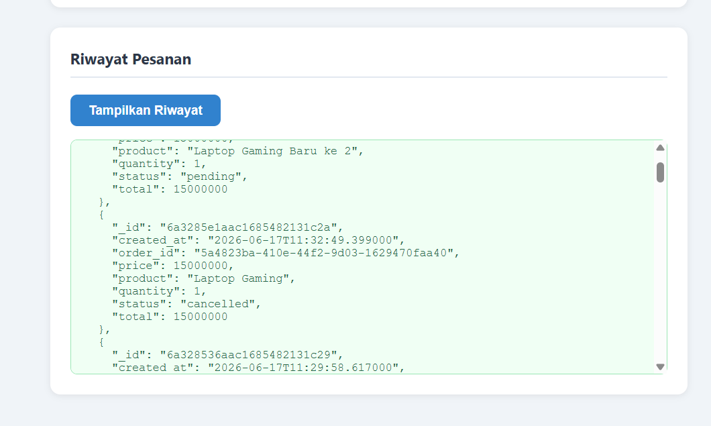

---

## 5. Hasil Load Testing

Load testing dilakukan menggunakan Locust (`Resources/Test/locustfile.py`) dari komputer host yang **berbeda** dari server aplikasi. Database di-reset setelah setiap skenario (hanya data yang diinsert selama testing, bukan data awal).

**Reset database antar skenario** (restore ke baseline + buat ulang index, tanpa menghapus data awal):
```bash
docker exec db-mongodb-1 mongorestore --drop /dump --quiet
docker exec db-mongodb-1 mongosh orderdb --quiet --eval '
  db.orders.createIndex({created_at:-1});
  db.orders.createIndex({order_id:1});
  db.orders.createIndex({user_id:1,created_at:-1});'
```
Setiap skenario dijalankan **60 detik** dengan target **2.000 user** secara konsisten (Locust headless), agar hasil antar skenario dapat dibandingkan secara adil.

### Skenario 1, Maksimum RPS (0% Failure)

- **Parameter:** 2.000 user, spawn rate 20 user/detik
- **Durasi:** 60 detik
- **Target:** RPS tertinggi dengan 0% failure

| Metric | Nilai |
|--------|-------|
| Max RPS (0% failure) | **168,53 RPS** |
| Total Request | 10.128 |
| Failure | **0%** |
| Median Response Time | 780 ms |
| 95th Percentile | 3.800 ms |
| 99th Percentile | 4.800 ms |
| Jumlah User | 2.000 |

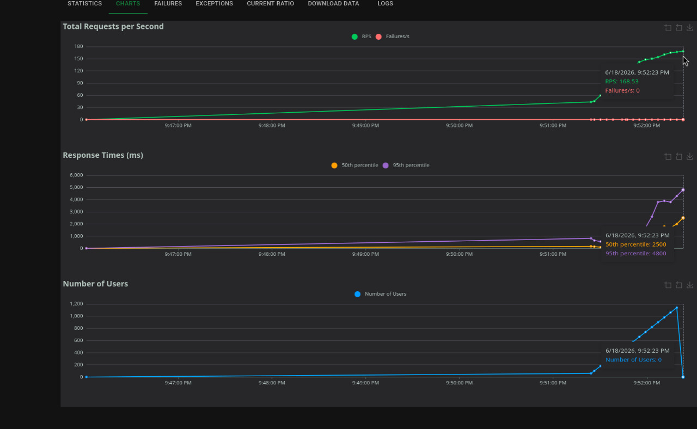


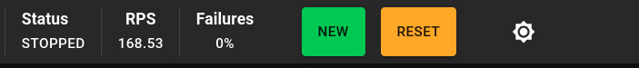

Dengan ramp bertahap (spawn rate 20), sistem mencapai **RPS tertinggi 168,53 dengan 0% failure** pada 2.000 user, dan latensi paling rendah di antara semua skenario (median 780 ms) karena beban naik perlahan sehingga MongoDB tidak langsung jenuh.

### Skenario 2, Peak Concurrency (Spawn Rate 50)

- **Parameter:** 2.000 user, spawn rate 50 user/detik
- **Durasi:** 60 detik

| Metric | Nilai |
|--------|-------|
| Max Concurrent Users (0% failure) | **2.000** |
| RPS | 154,86 |
| Failure | **0%** |
| Median Response Time | 4.800 ms |
| 95th Percentile | 12.000 ms |
| Total Request | 9.341 |

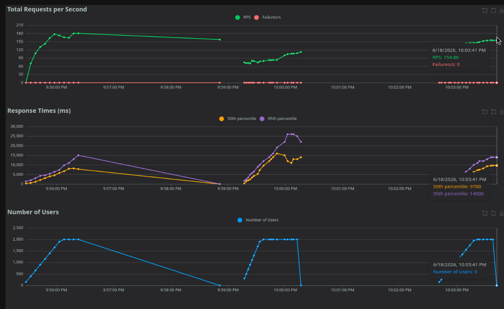


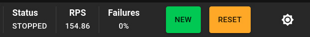

Pada spawn rate 50, sistem **0% failure hingga 2.000 user** dengan RPS 154,86. Latensi naik (median 4,8 detik) dibanding ramp 20 karena beban datang lebih cepat.

### Skenario 3, Peak Concurrency (Spawn Rate 100)

- **Parameter:** 2.000 user, spawn rate 100 user/detik
- **Durasi:** 60 detik

| Metric | Nilai |
|--------|-------|
| Max Concurrent Users (0% failure) | **2.000** |
| RPS | 112,52 |
| Failure | **0%** |
| Median Response Time | 12.000 ms |
| 95th Percentile | 23.000 ms |
| 99th Percentile | 26.000 ms |
| Total Request | 6.769 |

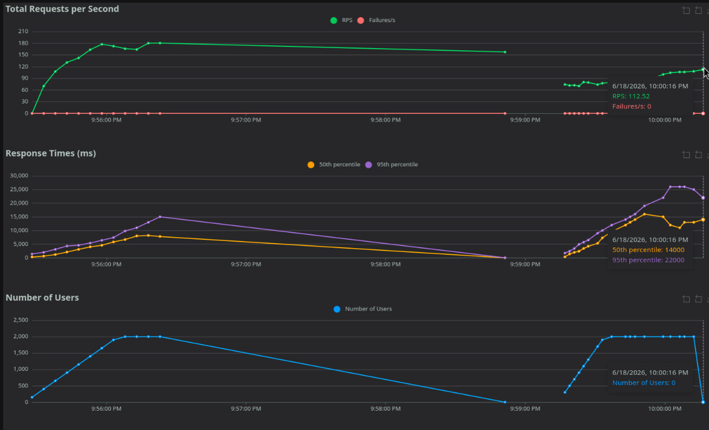


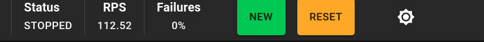

Pada spawn rate 100, sistem tetap **0% failure hingga 2.000 user**, namun throughput turun ke 112,52 RPS dan median response time naik ke 12 detik — efek lonjakan yang lebih agresif membebani MongoDB.

### Skenario 4, Peak Concurrency (Spawn Rate 200)

- **Parameter:** 2.000 user, spawn rate 200 user/detik
- **Durasi:** 60 detik

| Metric | Nilai |
|--------|-------|
| Max Concurrent Users | **2.000** |
| RPS | 300,19 |
| Failure | 1 request (~0,01%) |
| Median Response Time | 260 ms |
| 95th Percentile | 24.000 ms |
| 99th Percentile | 29.000 ms |
| Total Request | 18.055 |

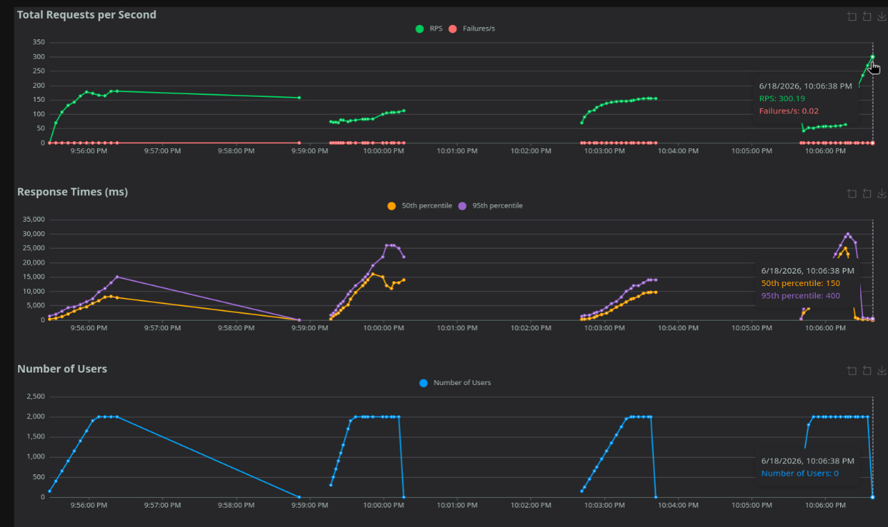


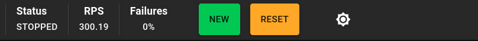

Pada spawn rate 200 terlihat distribusi respons yang **bimodal**: median sangat rendah (260 ms) namun p95 sangat tinggi (24 detik). Sebagian besar request terlayani sangat cepat sementara sebagian kecil tertahan antrian MongoDB, sehingga total request & RPS terlihat lebih tinggi. Muncul pula 1 request gagal (~0,01%).

### Skenario 5, Peak Concurrency (Spawn Rate 500)

- **Parameter:** 2.000 user, spawn rate 500 user/detik
- **Durasi:** 60 detik

| Metric | Nilai |
|--------|-------|
| Max Concurrent Users (0% failure) | **2.000** |
| RPS | 81,87 |
| Failure | **0%** |
| Median Response Time | 19.000 ms |
| 95th Percentile | 37.000 ms |
| 99th Percentile | 39.000 ms |
| Total Request | 4.921 |

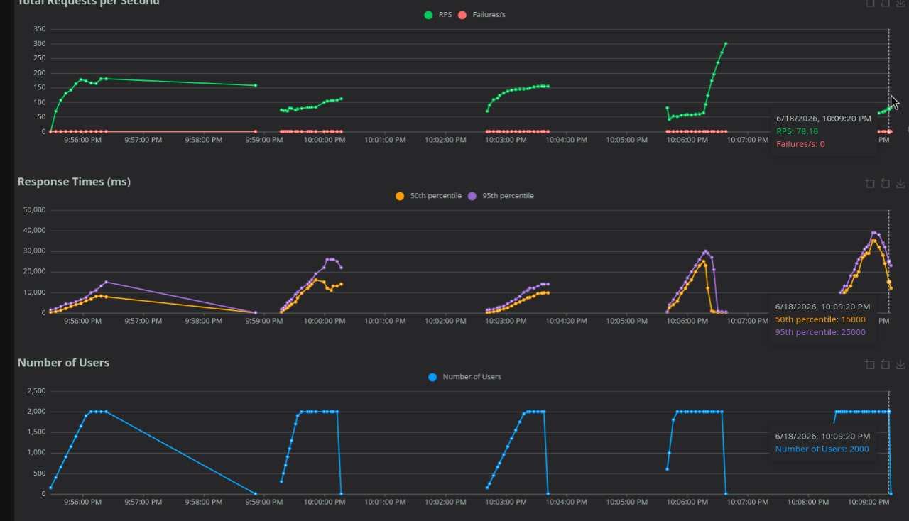

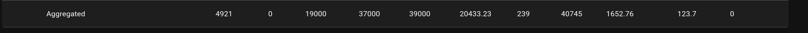

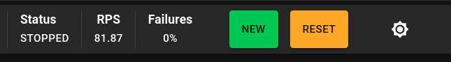

Pada spawn rate 500 (skenario paling ekstrem), sistem **tetap 0% failure hingga 2.000 user**, tetapi throughput jatuh ke 81,87 RPS dengan latensi terparah (median 19 detik, p99 39 detik). Lonjakan mendadak 500 user/detik mensimulasikan flash sale — request tidak ditolak, tetapi sangat lambat akibat bottleneck database.

### Ringkasan Hasil Load Testing

| Skenario | Spawn Rate | Max Users (0% fail) | RPS | Median (ms) |
|----------|------------|----------------------|-----|-------------|
| 1 – Maks RPS | 20 | 2.000 | **168,53** | 780 |
| 2 | 50 | 2.000 | 154,86 | 4.800 |
| 3 | 100 | 2.000 | 112,52 | 12.000 |
| 4 | 200 | 2.000 | 300,19* | 260* |
| 5 | 500 | 2.000 | 81,87 | 19.000 |

> *Skenario 4 menunjukkan pola bimodal (median sangat rendah, p95 sangat tinggi) sehingga angka RPS-nya tidak setara dengan skenario lain — lihat penjelasan pada bagian Skenario 4.

### Analisis

Dari hasil pengujian, arsitektur Docker Swarm dengan 4 replica backend mampu mendistribusikan beban secara merata ke seluruh worker node. Traefik sebagai load balancer dengan algoritma round-robin memberikan distribusi request yang adil antar container.

Pada spawn rate tinggi (200–500), bottleneck umumnya muncul di sisi koneksi MongoDB karena antrian operasi tulis `POST /order` mulai menumpuk. Penggunaan index pada koleksi `orders` membantu mempertahankan performa `GET /orders` meskipun jumlah dokumen bertambah.

---

## 6. Kesimpulan dan Saran

### Kesimpulan

Implementasi Order Processing Service pada infrastruktur Docker Swarm di Digital Ocean berhasil:

1. **Seluruh endpoint berfungsi** dengan benar — POST, GET, PUT order semua memberikan respons sesuai spesifikasi.
2. **Arsitektur multi-replica** dengan Traefik load balancer terbukti meningkatkan throughput dibandingkan deployment single-instance.
3. **Pemisahan database** ke VM tersendiri mengurangi resource contention dan meningkatkan stabilitas di bawah beban tinggi.
4. **Budget terkontrol** — Total $72/bulan dari alokasi $75, menyisakan buffer $3 untuk biaya transfer/snapshot.

### Saran untuk Production Deployment

1. **Gunakan Managed Database** — Ganti MongoDB self-hosted dengan MongoDB Atlas atau DigitalOcean Managed MongoDB untuk built-in replication, backup otomatis, dan failover.
2. **Tambahkan CDN** — Frontend yang bersifat statis idealnya di-serve dari CDN (Cloudflare/DO Spaces) untuk mengurangi beban server dan meningkatkan latency global.
3. **Implementasi Horizontal Auto-Scaling** — Integrasikan monitoring (Prometheus + Grafana) dengan trigger otomatis untuk menambah replica saat RPS atau CPU melewati threshold tertentu.
4. **Gunakan HTTPS** — Konfigurasikan TLS di Traefik menggunakan Let's Encrypt (sudah tersedia di Traefik) untuk keamanan data in-transit.
5. **Connection Pooling** — Atur `maxPoolSize` pada `MongoClient` di `app.py` agar koneksi tidak berlebihan saat concurrent user tinggi.
6. **Rate Limiting** — Tambahkan middleware rate limiting di Traefik untuk mencegah abuse pada endpoint `/order`.
7. **Pisahkan Log & Monitoring** — Gunakan stack ELK atau Loki + Grafana untuk centralized logging dari semua replica backend.

---

## Referensi

- [Docker Swarm Documentation](https://docs.docker.com/engine/swarm/)
- [Traefik Docker Provider](https://doc.traefik.io/traefik/providers/docker/)
- [MongoDB Indexing Strategies](https://www.mongodb.com/docs/manual/applications/indexes/)
- [Locust Documentation](https://docs.locust.io/)
